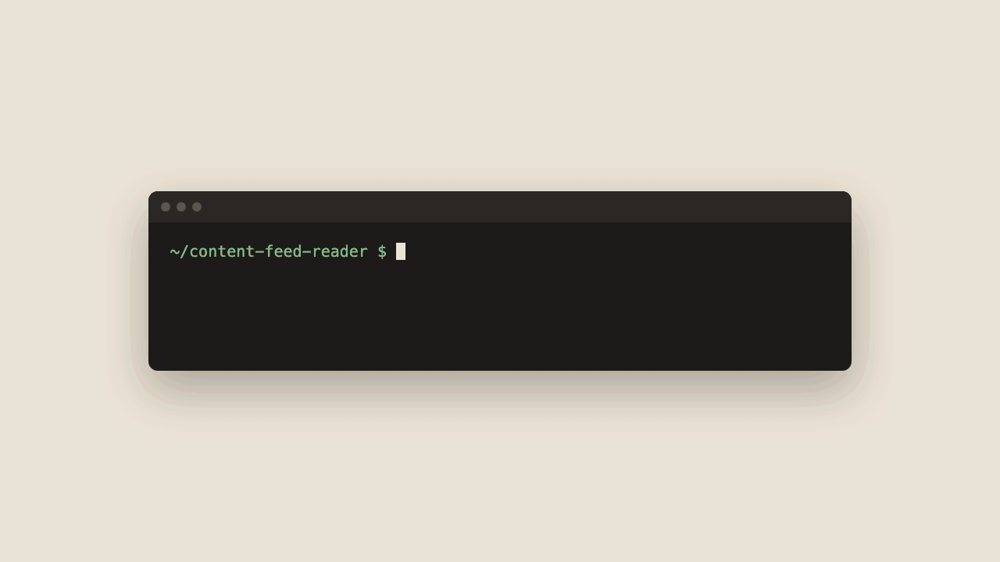

<p align="center">
  <a href="https://businesslens.io">
    <picture>
      <source media="(prefers-color-scheme: dark)" srcset="./layers/nuxt/theme/public/brand/logo/mark-dark.svg">
      
    </picture>
  </a>
</p>

<h1 align="center"><a href="https://businesslens.io">BusinessLens</a></h1>
<p align="center"><strong>Product-Driven Development for coding agents</strong></p>
<p align="center">Your AI agent is guessing what the product is. PDD gives agents and humans a shared product model that is git-tracked, reviewable, and verifiable.</p>

<p align="center">
  <a href="https://www.npmjs.com/package/businesslens"></a>
  <a href="https://github.com/businesslens/pdd/actions/workflows/check.yml"></a>
  <a href="./LICENSE"></a>
</p>

<p align="center">
<code>npx businesslens install</code>
</p>

<p align="center">
  
</p>

<p align="center">
<a href="#map-existing-repo-recommended"><strong>Map your own repo today!</strong></a>
</p>

---

> **BusinessLens** keeps what your product does in a Git-tracked
> `.businesslens/` folder of Markdown files, and gives your coding agent the
> skills to write it, follow it and check the code against it.

## Why a Product Model in the AI era

Agents write code faster than anyone can explain to them what the product is.
They fill the gaps by guessing, and the guesses ship.

1. **One definition.** Not scattered across tickets, docs, chats and people, but one model beside the code.
2. **Agents know what to build.** They read the Journeys, Scenarios and Rules instead of guessing.
3. **Done means it matches the product.** Verify checks the code against the approved model.
4. **Drift is easy to spot.** The model stays a clear reference as behavior changes.
5. **Decisions travel with the code.** Model and code changes are reviewed in one pull request.

**Dogfooded:** BusinessLens is developed with BusinessLens. Its own Product Model
lives in this repository's [`.businesslens/` folder](./.businesslens/), and the
demo above is that model in the local report.

## What the model covers, and what it doesn't

The model keeps what any rebuild of a web app, CLI or API would have to keep,
and nothing a rebuild is free to change:

| In the model | Left to design |
| --- | --- |
| Who can reach each place | Colors, typography, copy |
| What it shows and asks for | Components, layout, modals |
| What can be done there | Tabs, wizards and menus |
| Which rules apply | CLI syntax and flags |
| What happens next | API style: CRUD or RPC |

## Features

* 🤖 **Agent skills:** map, ideate and verify for Claude Code, Codex, Cursor, Gemini CLI and GitHub Copilot

* 📝 **Markdown-native:** every resource is a plain `.md` file in your repo, reviewed in pull requests

* ✅ **Lint and verify:** `businesslens lint` checks the files; `businesslens-verify` checks the code against them

* 🔁 **Fits your workflow:** implement with plan mode, an SDD tool or freestyle; PDD checks the code against the model as you go

* 🖥️ **Local report:** `businesslens view` opens the model in your browser and follows your edits

* 📦 **Blueprints:** start from a reviewed model for a common product instead of a blank page

* 🔒 **Local-first:** no account, no hosted service; the skills read your code and never run it

* 🆓 MIT-licensed and open source

---

##  Get started

```bash
npx businesslens install
```

Then start from where you are, inside your agent (Codex uses `$` instead of `/`):

### Map existing repo (recommended)

Have code? Run the map skill:

```text
/businesslens-map
```

It reads the code without running it, asks what the code can't answer, and
writes `.businesslens/` once you approve. Then open the report:

```bash
npx businesslens view
```

[From your repo](https://businesslens.io/docs/from-your-repo)

### Start from an idea

No code yet? Describe the product you want:

```text
I want to build a booking app for dog walkers
```

You pick from a few product shapes, then approve the model.
[From an idea](https://businesslens.io/docs/from-an-idea)

### Start from a Blueprint

A familiar kind of product? Pull a reviewed model:

```bash
npx businesslens blueprint pull <name>
```

[Browse the catalog](https://businesslens.io/blueprints) ·
[From a Blueprint](https://businesslens.io/docs/from-a-blueprint)

## The development loop

<p align="center">
  
</p>

Every change after that, you just ask:

```text
add guest checkout to the product   # ideate: approve the model change
implement it                        # your agent implements in phases; verify checks each
check the code against the model    # verify, whenever you want to be sure
```

##  Web interface

Read the Product Model as a report in your browser. It updates automatically
as you make changes. The server listens on `127.0.0.1` only and sends nothing
anywhere.

```bash
# This repository's model (opens the browser)
npx businesslens view

# A GitHub repository's pull request
npx businesslens view acme/checkout --pr 12

# Custom port, no browser
npx businesslens view --port 8080 --no-open
```

##  CLI reference

Every command and option: [CLI reference](https://businesslens.io/docs/cli).

Quick examples: `businesslens install`, `businesslens update`,
`businesslens lint`, `businesslens view`, `businesslens blueprint export`,
`businesslens blueprint pull <name>`, `businesslens blueprint open <report>`,
`businesslens blueprint contribute`.

Full help: `npx businesslens --help`

## License

BusinessLens is released under the **MIT License**: do anything, just give
credit. See [LICENSE](./LICENSE).
