<p align="center">
  <a href="https://businesslens.io">
    <picture>
      <source media="(prefers-color-scheme: dark)" srcset="./layers/nuxt/theme/public/brand/logo/mark-dark.svg">
      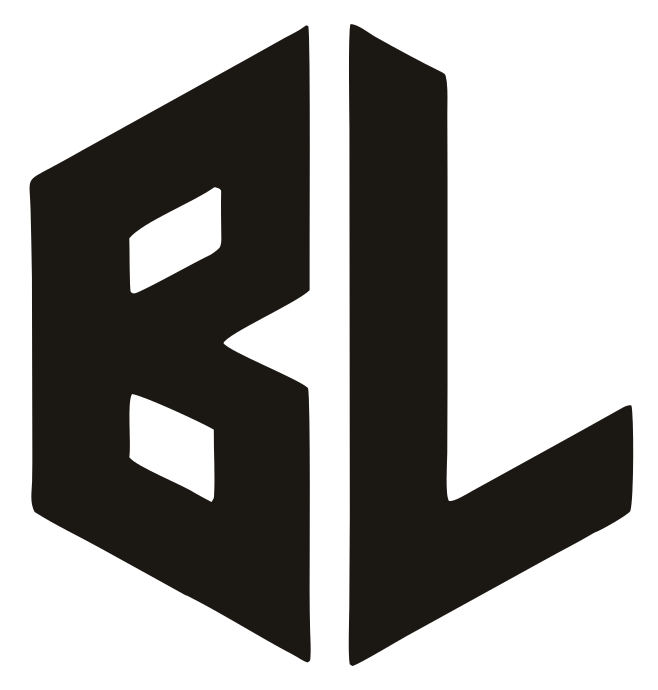
    </picture>
  </a>
</p>

<h1 align="center"><a href="https://businesslens.io">BusinessLens</a></h1>
<p align="center"><strong>Product-Driven Development for coding agents</strong></p>
<p align="center">Your AI agent is guessing what the product is. PDD gives agents and humans a shared product model that is git-tracked, reviewable, and verifiable.</p>

<p align="center">
  <a href="https://www.npmjs.com/package/businesslens"></a>
  <a href="https://github.com/businesslens/pdd/actions/workflows/check.yml"></a>
  <a href="./LICENSE"></a>
</p>

<p align="center">
<code>npx businesslens install</code>
</p>

<p align="center">
<a href="#map-existing-repo-recommended"><strong>Map your own repo today!</strong></a>
</p>

> **Fully open source (MIT).** The format, the CLI, the agent skills and the
> report are all in this repository. No account, no hosted service and no
> telemetry: the report runs on your own machine.

---

## The problem

Where is your **product model** today? Scattered across tickets, design docs,
the wiki, chats, source code, tests and people: shared by none, checked by
nothing. So your **AI agent guesses** what the product is
([AI is writing code for products it doesn't understand](https://businesslens.io/blog/your-agent-is-guessing)).

**Spec-driven development (SDD)** tools such as OpenSpec, spec-kit and Kiro
describe **each change**, with the product mixed into its design, plan and
tasks and spread across feature folders
([SDD describes the change, not the product](https://businesslens.io/blog/pdd-and-spec-driven-development)).

**Product-Driven Development (PDD)** keeps the **product in one place**, apart
from how it's built: a shared product model for agents and humans that is
**git-tracked, reviewable and verifiable**
([Introducing BusinessLens](https://businesslens.io/blog/introducing-businesslens)).

## The Product Model

`.businesslens/`, a [Product Model](https://businesslens.io/docs/product-model):
one definition of what the product does, as plain Markdown next to the code. It
is made of:

- **[Entities](https://businesslens.io/docs/entities):** what the product keeps, and who acts on it (Order, Customer, Payment provider).
- **[Interfaces](https://businesslens.io/docs/interfaces):** how people and systems reach the product (Web app, Mobile app, Partner API).
- **[Domains](https://businesslens.io/docs/domains):** the subject areas the product is split into (Ordering, Catalog, Billing).
- **[Capabilities](https://businesslens.io/docs/capabilities):** what the product lets someone do (Check out, Cancel order, Refund).
- **[Journeys](https://businesslens.io/docs/journeys):** one goal, carried across several capabilities (Browse and buy, Sign up, Reorder).
- **[Business rules](https://businesslens.io/docs/business-rules):** what must always hold, and who may do what (Max 3 per order, Only managers refund, Total includes tax).
- **[Variations](https://businesslens.io/docs/variations):** where the product works in more than one way (Feature flag, Plan tier, A/B test).

## Why a Product Model in the AI era

Agents write code faster than anyone can explain to them what the product is.
They fill the gaps by guessing, and the guesses ship.

1. **One definition.** Not scattered across tickets, docs, chats and people, but one model beside the code.
2. **Agents know what to build.** They read the Journeys, Scenarios and Rules instead of guessing.
3. **Done means it matches the product.** Verify checks the code against the approved model.
4. **Drift is easy to spot.** The model stays a clear reference as behavior changes.
5. **Decisions travel with the code.** Model and code changes are reviewed in one pull request.

## Example: the Product Model of a kanban board

To show what a Product Model answers, here is one for a **kanban board**: a
conceptual product where a small team plans its work on shared boards of
columns and cards, and an **AI agent proposes the next cards**. It is the
[Kanban Board](https://businesslens.io/blueprints/kanban-board) Blueprint, a
model with no code behind it. Every answer below is read from the model.

<p align="center">
  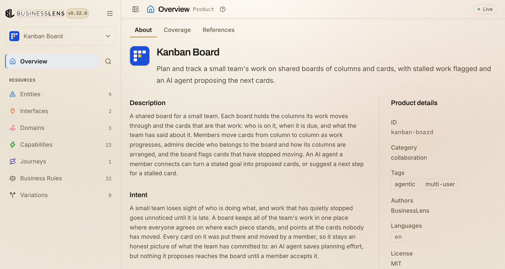
</p>

<p align="center">
<a href="https://businesslens.io/blueprints/kanban-board"><strong>View the Kanban Board Product Model live</strong></a>
</p>

Or open it on your machine:

```bash
npx businesslens blueprint pull kanban-board
npx businesslens view
```

### 1. What does each capability change?

The 9 entities in the kanban model (what the product keeps, and who acts on
it), and which capabilities create, change or remove each one. The first
screenshot lists all 9; the second is filtered to the four capabilities around
a proposed card:

- **Card proposals** creates a proposed card, never a card.
- **Proposed card acceptance** is what turns it into a card on the board.
- **Proposed card dismissal** changes the proposal and leaves the board alone.

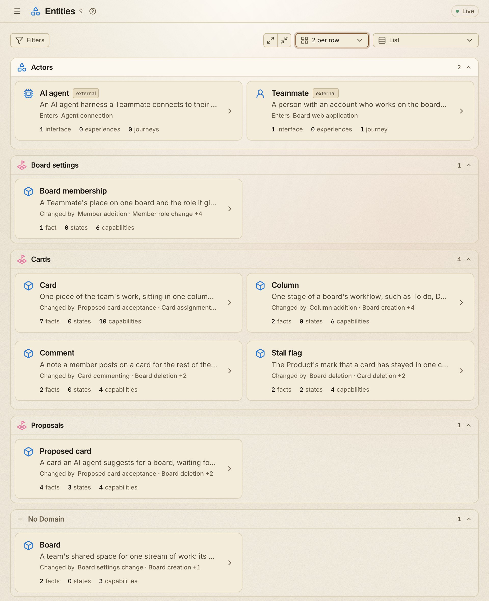

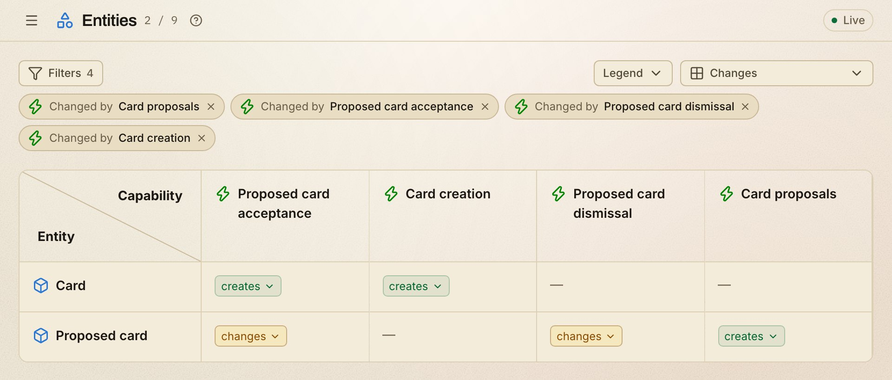

### 2. Which interfaces offer each capability?

All 23 capabilities in the kanban model, and which interfaces offer each one.
The first screenshot lists them; the second is filtered to six card
capabilities:

- **The agent connection** offers one capability: proposing cards.
- **Every change to a card** happens in the board web application, by a member.

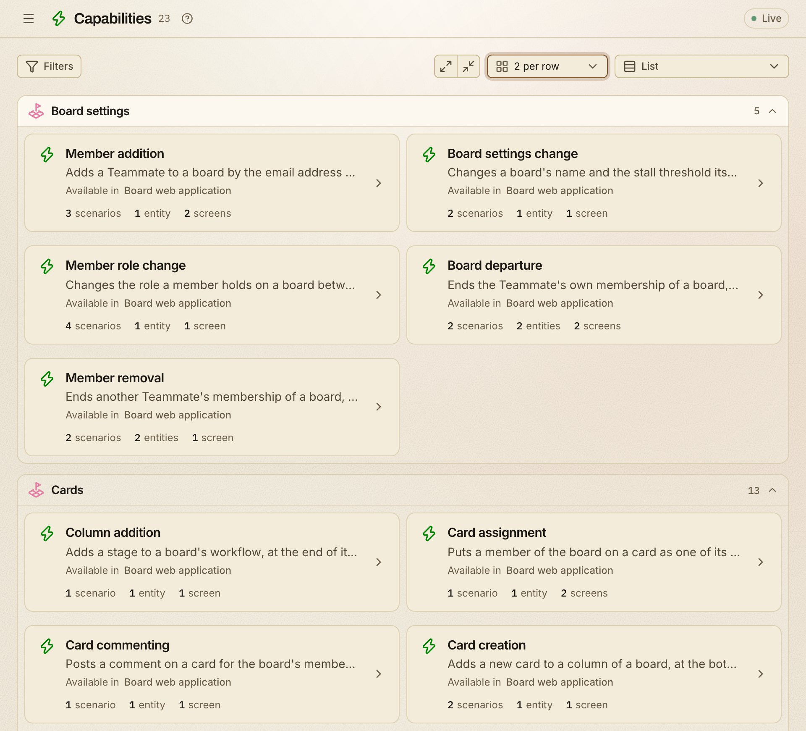

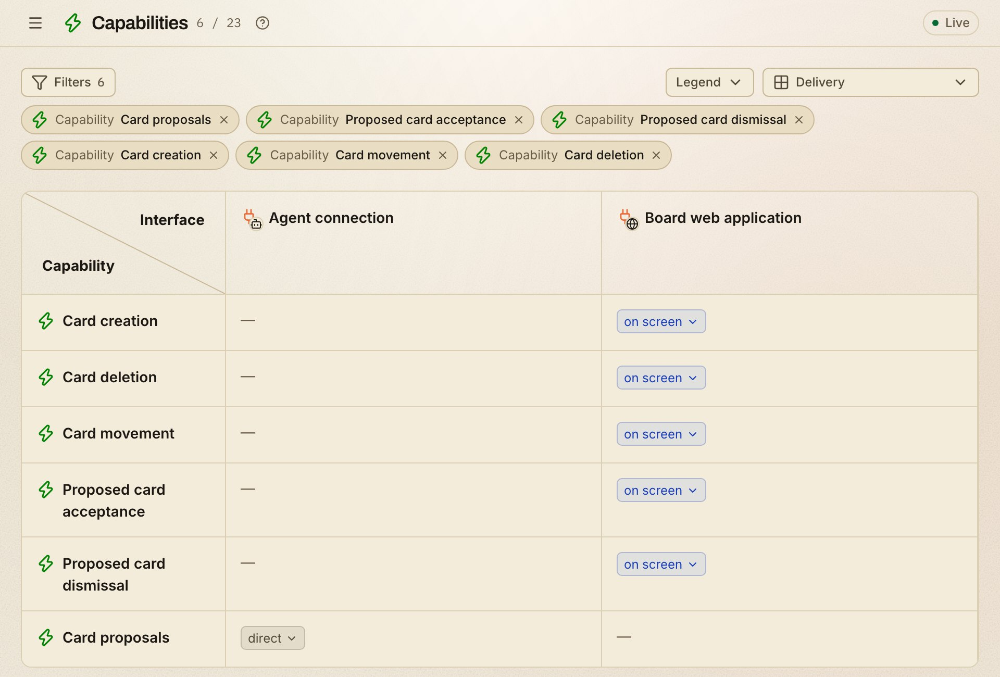

### 3. Where does each business rule apply?

All 32 business rules in the kanban model, and where each one is attached. The
first screenshot lists them; the second is filtered to the five attached to
the Proposed card entity:

- **Creating one:** only an AI agent a member connected proposes cards.
- **Deciding on one:** only the board's members accept or dismiss it.
- **Deleting one:** it goes only with its board.

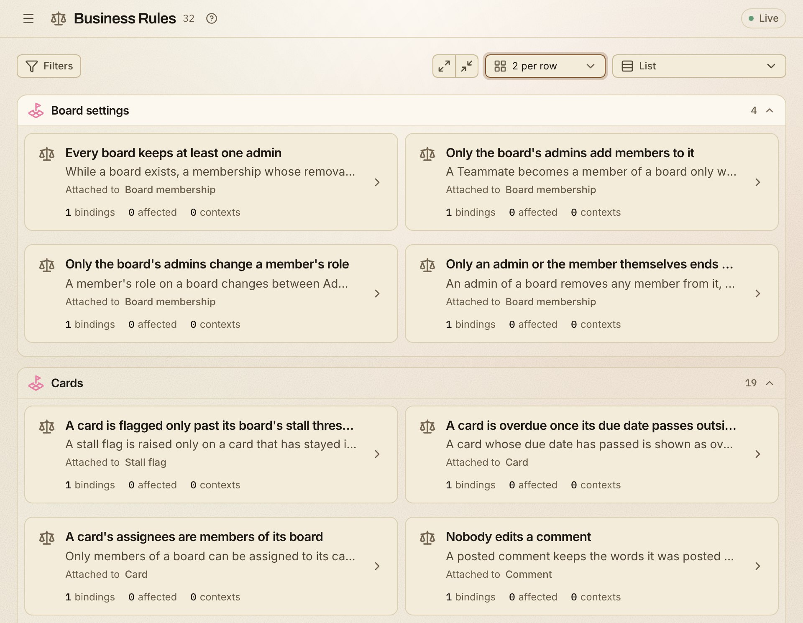


### 4. How does an entity move through its states?

The Proposed card entity, one of the 9: the information kept about it, and how
it moves through its states:

- **Four pieces of information:** its title, description, reason and suggested
  column.
- **Three states:** Proposed, then Accepted or Dismissed. Created and Removed
  mark where its life begins and ends.
- **Removing it** on its own is forbidden from every state; deleting its board
  removes it.

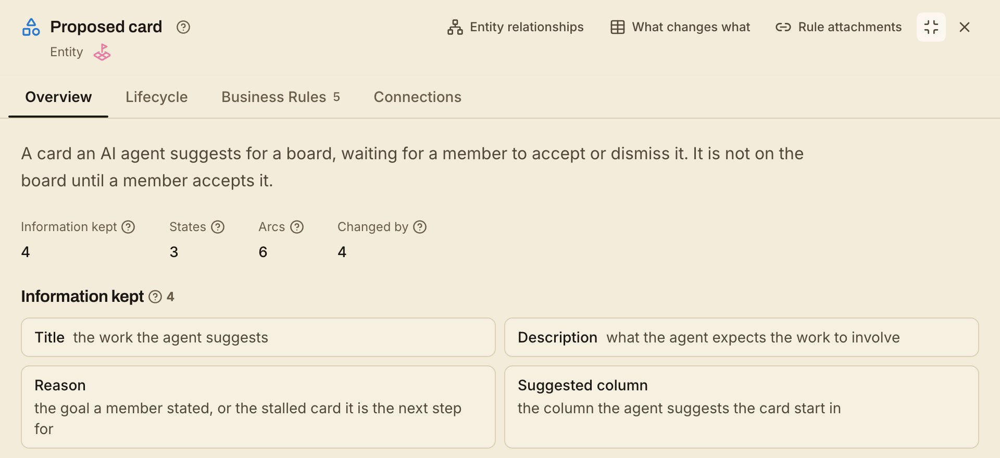


### 5. What exactly happens in one scenario?

The 4 scenarios of the Card proposals capability, then one of them opened step
by step:

- **Four scenarios:** proposing cards for a goal, proposing a next step for a
  stalled card, and two refusals.
- **Refuse a direct change from the AI agent:** the agent tries to move a card
  itself, and the product refuses. Every step says who acts, what is read,
  where, and which business rules govern it.
- **Its edge case:** editing, deleting or creating a card, or accepting its own
  proposal, is refused the same way.

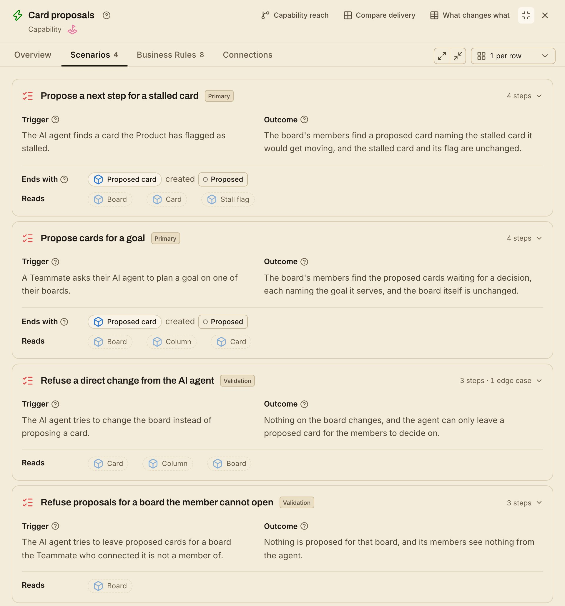

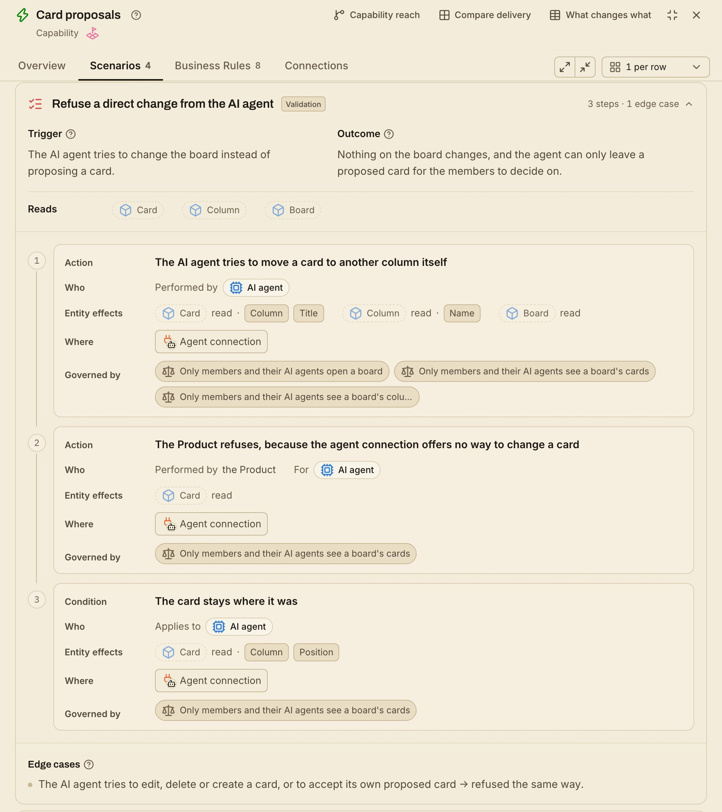

## Who it helps

One shared definition of what the product does helps everyone who works on it:

- **Maintainers and reviewers** see a behavior change as a change to the model,
  reviewed in the same pull request as the code.
- **New contributors** learn what the product does, who may do what and where,
  without reading the whole codebase first.
- **Product managers and docs writers** find product answers in one place,
  with optional references to the code and material behind them.
- **Coding agents** read the scenarios and business rules before they change
  anything, instead of guessing. The `businesslens-verify` skill checks the
  code against the model.

**Dogfooded:** BusinessLens is developed with BusinessLens. Its own Product Model
lives in this repository's [`.businesslens/` folder](./.businesslens/); open it
with `npx businesslens view businesslens/pdd`.

## Features

* 🤖 **Agent skills:** map, ideate and verify for Claude Code, Codex, Cursor, Gemini CLI and GitHub Copilot

* 📝 **Markdown-native:** every resource is a plain `.md` file in your repo, reviewed in pull requests

* ✅ **Lint and verify:** `businesslens lint` checks the files; `businesslens-verify` checks the code against them

* 🔁 **Fits your workflow:** implement with plan mode, an SDD tool or freestyle; PDD checks the code against the model as you go

* 🖥️ **Local report:** `businesslens view` opens the model in your browser and follows your edits

* 📦 **Blueprints:** start from a reviewed model for a common product instead of a blank page

* 🔒 **Local-first:** no account, no hosted service; the skills read your code and never run it

* 🆓 MIT-licensed and open source

---

##  Get started

```bash
npx businesslens install
```

This adds the skills to Claude Code, Codex, Cursor, Gemini CLI and GitHub
Copilot. Then start from where you are, inside your agent (Codex uses `$`
instead of `/`):

### Map existing repo (recommended)

Have code? Run the map skill:

```text
/businesslens-map
```

It reads the code without running it, asks what the code can't answer, and
writes `.businesslens/` once you approve. Then open the report:

```bash
npx businesslens view
```

[From your repo](https://businesslens.io/docs/from-your-repo)

### Start from an idea

No code yet? Describe the product you want:

```text
/businesslens-ideate I want to build a booking app for dog walkers
```

You pick from a few product shapes, then approve the model.
[From an idea](https://businesslens.io/docs/from-an-idea)

### Start from a Blueprint

A familiar kind of product? Pull a reviewed model:

```bash
npx businesslens blueprint pull <name>
```

[Browse the catalog](https://businesslens.io/blueprints) ·
[From a Blueprint](https://businesslens.io/docs/from-a-blueprint)

## The development loop

<p align="center">
  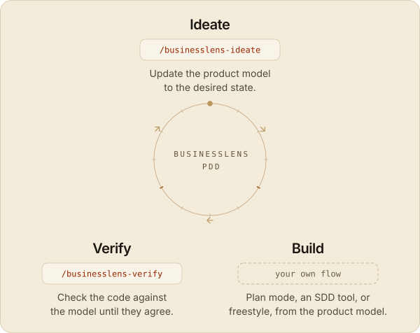
</p>

- **Ideate** (`/businesslens-ideate`): the agent records the change in the model
  first, and nothing is written until you approve it.
- **Implement:** your agent builds it your way, in phases, with plan mode, an
  SDD tool, or freestyle.
- **Verify** (`/businesslens-verify`): the agent checks the code against the
  model and fixes either one until they agree.

##  CLI

`install`, `update`, `lint`, `view` and the `blueprint` commands. Every command
and option: [CLI reference](https://businesslens.io/docs/cli), or
`npx businesslens --help`.

## License

BusinessLens is released under the **MIT License**: do anything, just give
credit. See [LICENSE](./LICENSE).
