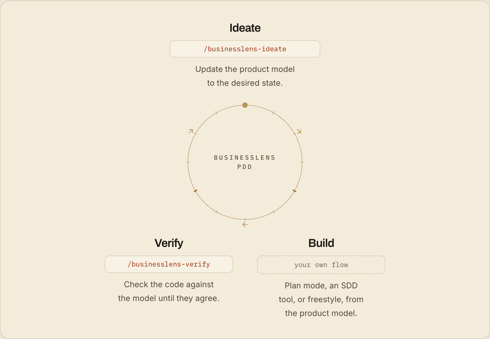

<p align="center">
  <picture>
    <source media="(prefers-color-scheme: dark)" srcset="./layers/nuxt/theme/public/brand/logo/mark-dark.svg">
    
  </picture>
</p>

<h1 align="center">BusinessLens</h1>
<p align="center"><strong>Product-Driven Development for coding agents</strong></p>
<p align="center">Your AI agent is guessing what the product is. Give it, and your team, one Product Model to build from and check against.</p>

<p align="center">
  <a href="https://www.npmjs.com/package/businesslens"></a>
  <a href="https://github.com/businesslens/pdd/actions/workflows/check.yml"></a>
  <a href="./LICENSE"></a>
</p>

<p align="center">
<code>npx businesslens install</code>
</p>

<p align="center">
  
</p>

---

> **BusinessLens** keeps what your product does in a Git-tracked
> `.businesslens/` folder of Markdown files, and gives your coding agent the
> skills to write it, follow it and check the code against it.

## Why a Product Model in the AI era

Agents write code faster than anyone can explain to them what the product is.
They fill the gaps by guessing, and the guesses ship.

1. **One definition, not many fragments.** Today the product lives across
   tickets, docs, chats, code and people. The Product Model writes it down once,
   beside the code, and links back to those sources.
2. **Agents know what to build.** Instead of inferring behavior and rules from
   whatever they can find, they read the Journeys, Scenarios and Business Rules
   before they start.
3. **Done means the code matches the product.** Code can work and still miss
   the intent. Verify checks it against the approved model, and model and code
   changes are reviewed together in one pull request.

## Features

* 🤖 **Agent skills:** map, ideate and verify for Claude Code, Codex, Cursor, Gemini CLI and GitHub Copilot

* 📝 **Markdown-native:** every resource is a plain `.md` file in your repo, reviewed in pull requests

* ✅ **Lint and verify:** `businesslens lint` checks the files; `businesslens-verify` checks the code against them

* 🔁 **Fits your build flow:** plan mode, an SDD tool or freestyle; BusinessLens never builds for you

* 🖥️ **Local report:** `businesslens view` opens the model in your browser and follows your edits

* 📦 **Blueprints:** start from a reviewed model for a common product instead of a blank page

* 🔒 **Local-first:** no account, no hosted service; the skills read your code and never run it

* 🆓 MIT-licensed and open source

---

## The development loop

<p align="center">
  
</p>

##  Getting started

```bash
npx businesslens install
```

Then start from where you are, inside your agent (Codex uses `$` instead of `/`):

| You have | Run | Guide |
| --- | --- | --- |
| Existing code | `/businesslens-map` | [From your repo](./docs/from-your-repo.md) |
| An idea | `/businesslens-ideate` | [From an idea](./docs/from-an-idea.md) |
| A familiar kind of product | `npx businesslens blueprint pull <name>` | [From a Blueprint](./docs/from-a-blueprint.md) |

Then every change runs the loop:

```text
/businesslens-ideate add guest checkout   # approve the model change
                                          # build it your usual way
/businesslens-verify this branch          # fix what disagrees, re-check
```

`map` is for adopting BusinessLens or covering more of the product; `verify` is
the everyday skill.

##  Web interface

Read the Product Model as a report in your browser. The server listens on
`127.0.0.1` only and sends nothing anywhere.

```bash
# This repository's model (opens the browser)
npx businesslens view

# A GitHub repository's pull request
npx businesslens view acme/checkout --pr 12

# Custom port, no browser
npx businesslens view --port 8080 --no-open
```

**Features:**

* Overview, then one collection per resource type
* Rows, Graph and Matrix drawings of the same set
* Every resource opens in a complete reading
* Search across the whole model
* Live updates as you save

##  CLI reference

Every command and option: [CLI reference](./docs/cli.md).

Quick examples: `businesslens install`, `businesslens update`,
`businesslens lint`, `businesslens view`, `businesslens blueprint export`,
`businesslens blueprint pull <name>`, `businesslens blueprint open <report>`,
`businesslens blueprint contribute`.

Full help: `npx businesslens --help`

## License

BusinessLens is released under the **MIT License**: do anything, just give
credit. See [LICENSE](./LICENSE).
