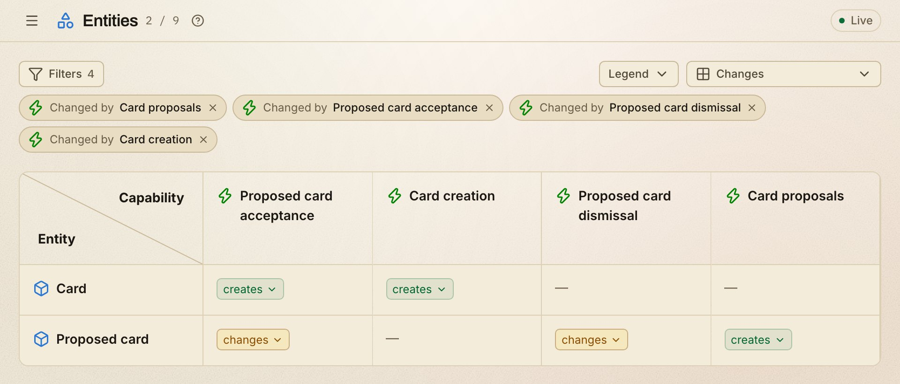
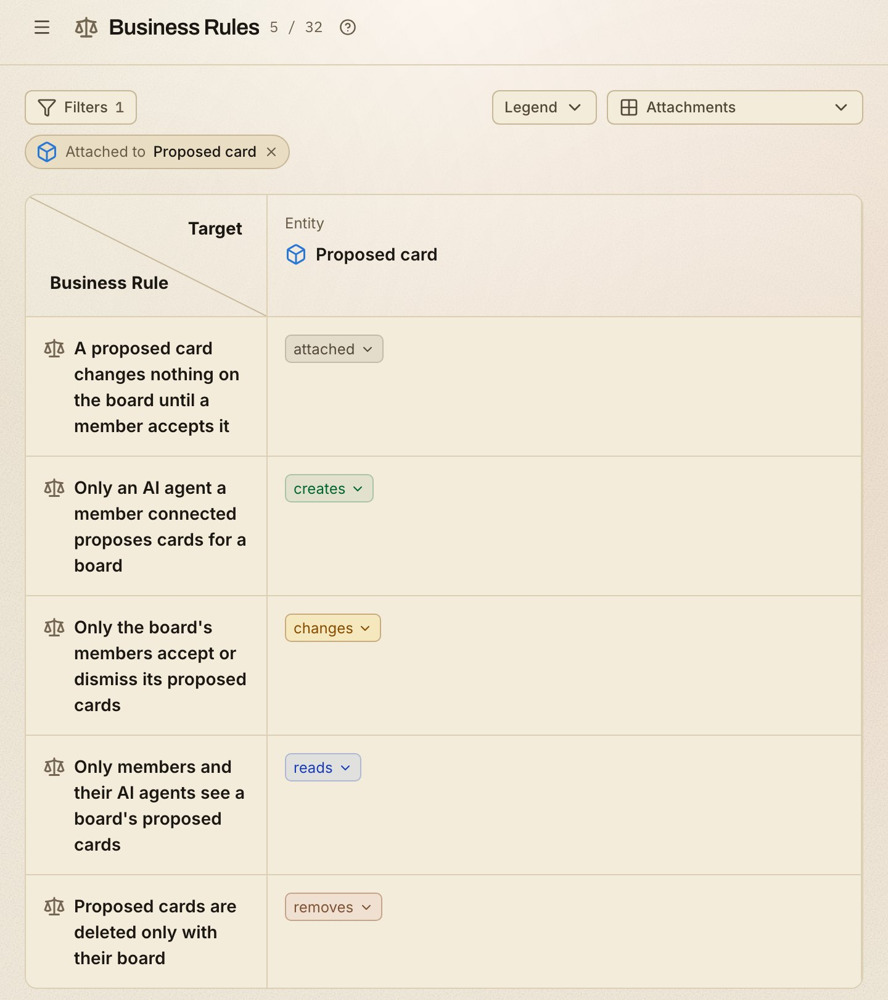
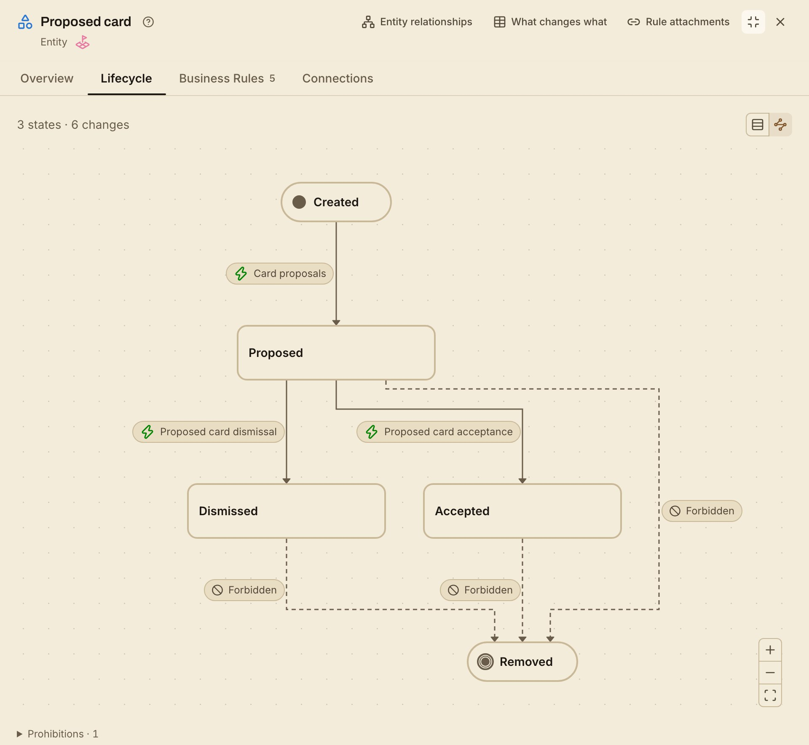

<p align="center">
  <a href="https://businesslens.io">
    <picture>
      <source media="(prefers-color-scheme: dark)" srcset="./layers/nuxt/theme/public/brand/logo/mark-dark.svg">
      
    </picture>
  </a>
</p>

<h1 align="center"><a href="https://businesslens.io">BusinessLens</a></h1>
<p align="center"><strong>Product-Driven Development for coding agents</strong></p>
<p align="center">Your AI agent is guessing what the product is. PDD gives agents and humans a shared product model that is git-tracked, reviewable, and verifiable.</p>

<p align="center">
  <a href="https://www.npmjs.com/package/businesslens"></a>
  <a href="https://github.com/businesslens/pdd/actions/workflows/check.yml"></a>
  <a href="./LICENSE"></a>
</p>

<p align="center">
<code>npx businesslens install</code>
</p>

<p align="center">
  
</p>

<p align="center">
<a href="#map-existing-repo-recommended"><strong>Map your own repo today!</strong></a>
</p>

> **Fully open source (MIT).** The format, the CLI, the agent skills and the
> report are all in this repository. No account, no hosted service and no
> telemetry: the report runs on your own machine.

---

## The problem

Where is your product model today? Scattered across tickets, design docs, the
wiki, chats, source code, tests and people: shared by none, checked by nothing.
So your AI agent guesses what the product is
([AI is writing code for products it doesn't understand](https://businesslens.io/blog/your-agent-is-guessing)).

Spec-driven development (SDD) tools such as OpenSpec, spec-kit and Kiro describe
each change, with the product mixed into its design, plan and tasks and spread
across feature folders
([SDD describes the change, not the product](https://businesslens.io/blog/pdd-and-spec-driven-development)).

Product-Driven Development (PDD) keeps the product in one place, apart from how
it's built: a shared product model for agents and humans that is git-tracked,
reviewable and verifiable
([Introducing BusinessLens](https://businesslens.io/blog/introducing-businesslens)).

## The Product Model

One definition of what the product does, as plain Markdown in a
`.businesslens/` folder next to the code. The
[Product Model](https://businesslens.io/docs/product-model) is made of:

- **[Entities](https://businesslens.io/docs/entities)**: what the product keeps, and who acts on it. *Card, Board, AI agent*
- **[Interfaces](https://businesslens.io/docs/interfaces)**: how people and systems reach the product. *Board web application, Agent connection*
- **[Domains](https://businesslens.io/docs/domains)**: the subject areas the product is split into. *Cards, Board settings, Proposals*
- **[Capabilities](https://businesslens.io/docs/capabilities)**: what the product lets someone do. *Card movement, Member addition, Card proposals*
- **[Journeys](https://businesslens.io/docs/journeys)**: one goal, carried across several capabilities. *Set up a team board*
- **[Business Rules](https://businesslens.io/docs/business-rules)**: what must always hold, and who may do what. *Only the board's members change its cards; A proposed card changes nothing on the board until a member accepts it*
- **[Variations](https://businesslens.io/docs/variations)**: where the product works in more than one way. *Feature flag, Plan tier, A/B test*

## What the model covers, and what it doesn't

The model keeps what any rebuild of a web app, CLI or API would have to keep,
and nothing a rebuild is free to change:

| In the model | Left to design |
| --- | --- |
| Who can reach each place | Colors, typography, copy |
| What it shows and asks for | Components, layout, modals |
| What can be done there | Tabs, wizards and menus |
| Which rules apply | CLI syntax and flags |
| What happens next | API style: CRUD or RPC |

## Questions the model answers

`npx businesslens view` opens the model as a report in your browser. Here it is
for the [Kanban Board](https://businesslens.io/blueprints/kanban-board)
Blueprint, a team board where an AI agent proposes the next cards. Every answer
below is read from its model, not from its code.

### 1. What does each capability change?

Which capabilities create, change or remove each entity:

- **Card proposals** creates a proposed card, never a card.
- **Proposed card acceptance** is what turns it into a card on the board.
- **Proposed card dismissal** changes the proposal and leaves the board alone.



### 2. Where can each capability be done?

Which interfaces offer each capability:

- **The agent connection** offers one capability: proposing cards.
- **Every change to a card** happens in the web application, by a member.


### 3. Which rules apply, and to what?

Every Business Rule attached to the proposed card, and what each one governs:

- **Creating one:** only an AI agent a member connected proposes cards.
- **Deciding on one:** only the board's members accept or dismiss it.
- **Deleting one:** it goes only with its board.



### 4. How does a proposed card move through its states?

The Proposed card entity and the capability behind every move:

- **Three states:** Proposed, then Accepted or Dismissed. Created and Removed
  mark where its life begins and ends.
- **Removing it** on its own is forbidden from every state; deleting its board
  removes it.



### 5. What exactly happens in one scenario?

The four scenarios of Card proposals, with one opened step by step:

- **Refuse a direct change from the AI agent:** the agent tries to move a card
  itself, and the product refuses.
- **Every step** says who acts, what is read, where, and which rules govern it.
- **Its edge case:** editing, deleting or creating a card, or accepting its own
  proposal, is refused the same way.


## Who it helps

- **Maintainers and reviewers** see a behavior change as a change to the model,
  reviewed in the same pull request as the code.
- **New contributors** learn what the product does, who may do what and where,
  without reading the whole codebase first.
- **Product managers and docs writers** find product answers in one place,
  with optional references to the code and material behind them.
- **Coding agents** read the Journeys, Scenarios and Rules before they change
  anything, instead of guessing, and verify checks their code against the model.

**Dogfooded:** BusinessLens is developed with BusinessLens. Its own Product Model
lives in this repository's [`.businesslens/` folder](./.businesslens/); open it
with `npx businesslens view businesslens/pdd`.

---

##  Get started

```bash
npx businesslens install
```

This adds the skills to Claude Code, Codex, Cursor, Gemini CLI and GitHub
Copilot. Then start from where you are, inside your agent (Codex uses `$`
instead of `/`):

### Map existing repo (recommended)

Have code? Run the map skill:

```text
/businesslens-map
```

It reads the code without running it, asks what the code can't answer, and
writes `.businesslens/` once you approve. Then open the report:

```bash
npx businesslens view
```

[From your repo](https://businesslens.io/docs/from-your-repo)

### Start from an idea

No code yet? Describe the product you want:

```text
/businesslens-ideate I want to build a booking app for dog walkers
```

You pick from a few product shapes, then approve the model.
[From an idea](https://businesslens.io/docs/from-an-idea)

### Start from a Blueprint

A familiar kind of product? Pull a reviewed model:

```bash
npx businesslens blueprint pull <name>
```

[Browse the catalog](https://businesslens.io/blueprints) ·
[From a Blueprint](https://businesslens.io/docs/from-a-blueprint)

## The development loop

<p align="center">
  
</p>

- **Ideate:** ask your agent for a product change. It proposes the change to the
  model, and nothing is written until you approve it.
- **Implement:** your agent builds it your way, in phases, with plan mode, an
  SDD tool, or freestyle.
- **Verify:** your agent checks the code against the approved model, phase by
  phase, until they agree.

##  CLI

`install`, `update`, `lint`, `view` and the `blueprint` commands. Every command
and option: [CLI reference](https://businesslens.io/docs/cli), or
`npx businesslens --help`.

## License

BusinessLens is released under the **MIT License**: do anything, just give
credit. See [LICENSE](./LICENSE).
