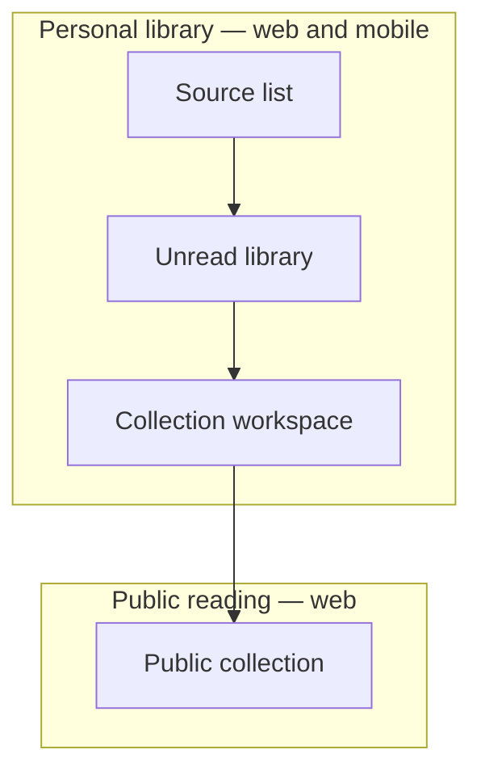

# Content Feed Reader screen map

This supporting UX map groups Product Screens by Experience. The Product Model
owns their purpose and behavior; this diagram shows likely navigation without
becoming a second contract.

The arrows show common reachability, not required Journey steps. Journeys and
Scenarios remain the acceptance contract.
