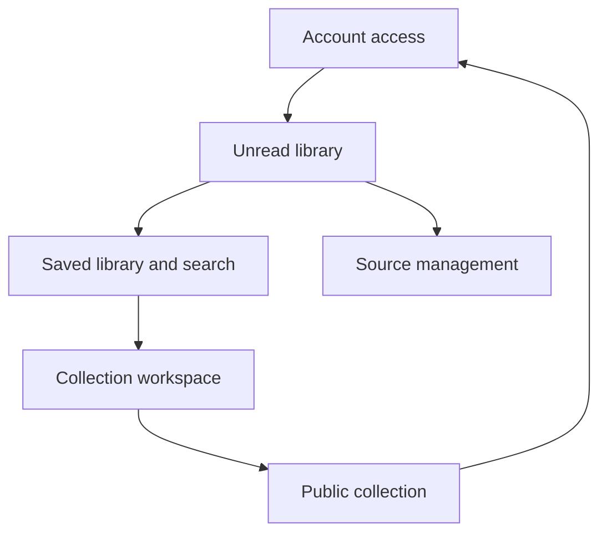

# Content & Feed Reader screen map

This supporting UX map groups product Screens by Experience. The Product Model
owns the Screen purpose, information, actions, states, and relationships; this
diagram is an external visual reference and is not a second product contract.

The arrows show common reachability, not a required user journey. Canonical
goal-oriented behavior remains in the Product Model's Journeys and Scenarios.
Web routes and supported mobile deep links remain on Experiences and Screens.
