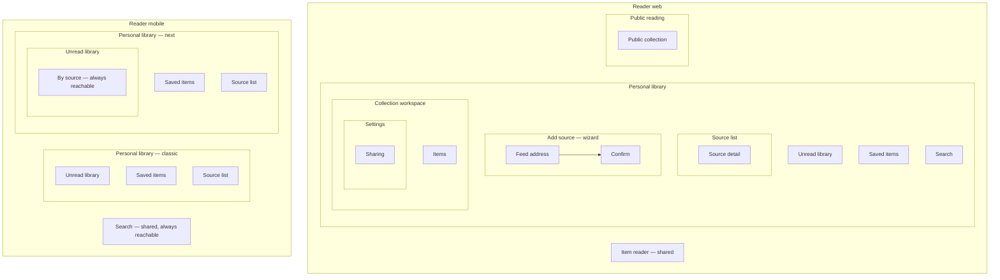

# Content Feed Reader screen map

This supporting UX map groups Product Screens by Experience and shows where
they nest. The Product Model owns their purpose, facts and behavior; this
diagram is a reading aid, not a second contract.

```mermaid
flowchart TD
  subgraph web[Reader web]
    reader[Item reader — shared]
    subgraph library[Personal library]
      unread[Unread library]
      saved[Saved items]
      search[Search]
      subgraph sources[Source list]
        detail[Source detail]
      end
      subgraph add[Add source — wizard]
        address[Feed address] --> confirm[Confirm]
      end
      subgraph workspace[Collection workspace]
        items[Items]
        subgraph settings[Settings]
          sharing[Sharing]
        end
      end
    end
    subgraph public[Public reading]
      shared[Public collection]
    end
  end

  subgraph mobile[Reader mobile]
    msearch[Search — shared, always reachable]
    subgraph classic[Personal library — classic]
      cunread[Unread library]
      csaved[Saved items]
      csources[Source list]
    end
    subgraph next[Personal library — next]
      subgraph nunread[Unread library]
        bysource[By source — always reachable]
      end
      nsaved[Saved items]
      nsources[Source list]
    end
  end
```

Frames are containment; a wizard's arrow is its order. Movement between
Screens is derived from Scenario Steps and drawn by the report's UI map, so
none is drawn here.
