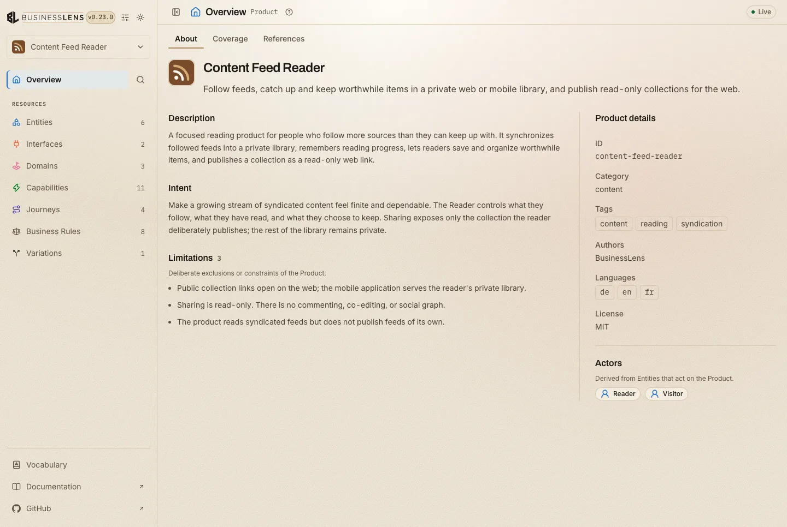

# BusinessLens: Product-Driven Development for coding agents

BusinessLens is Product-Driven Development for coding agents. It keeps a
durable Product contract in `.businesslens/`: what your product does, for whom,
where, and under which rules, including where it works more than one way
([Variations](./variations.md): feature flags, plan tiers, A/B tests, API
versions). The [Model overview](./product-model.md) explains the folder in five
minutes.

The Product Model says what the product is intended to do. It does not prescribe
the stack or replace your plan mode, SDD framework, coding agent, or tests.

## What the model covers, and what it doesn't

The model keeps what any rebuild of your web app, CLI or API would have to
keep, and nothing a rebuild is free to change:

| In the model | Left to design |
| --- | --- |
| Who can reach each place | Colors, typography, copy |
| What it shows and asks for | Components, layout, modals |
| What can be done there | Tabs, wizards and menus |
| Which rules apply | CLI syntax and flags |
| What happens next | API style: CRUD or RPC |

That is why [Interfaces](./interfaces.md) and their Screens are in it: a refund
operators issue in an admin console is a different product from one shoppers
request on the website.

## The development loop

Every product change runs the same loop:

::development-loop
```text
ideate → implement ⇄ verify
   ▲                     │
   └──── next change ────┘

implement: your agent, your way, in phases
```
::

Ideate and verify with BusinessLens. Your own agent implements, your way.

- **Ideate** with [`/businesslens-ideate`](./skill-businesslens-ideate.md):
  Decide the next change and record it in the product model.
- **Implement** with your agent, your way: In phases, with plan mode, an SDD
  tool, or freestyle.
- **Verify** with [`/businesslens-verify`](./skill-businesslens-verify.md):
  Check and improve the code and product model until they agree.

You don't have to name a skill. Ask your agent for a change, such as "add
guest checkout to the product", and ideate decides it with you. Ask it to
implement the change, and verify plans the work in phases: your agent
implements each phase, and verify checks every part of it before the next
starts. You can also
[choose the pace](./skill-businesslens-verify.md#choose-the-pace): one part at
a time, or everything in one go without phases. Ask your agent to check the
code against the model whenever you want to be sure, for example before a
release.

Ideate changes the model only with your approval. Your agent changes the code
and never the model. A product question that comes up while implementing comes
back to you; it is never decided in code.

## See the model at any time

At any point in the loop, open the model as a local report in your browser:

```bash
npx businesslens view
```



It updates as the files change, so you can keep it open while you ideate,
review a change, or verify. See [`view`](./cli-view.md) for the options.

## What BusinessLens never does

- Run your code to check it: the skills read it, they never execute it. While
  implementing, your agent runs your tests the way it always does.
- Write outside `.businesslens/`, or edit your AGENTS.md, CLAUDE.md or README.
- Commit for you.

These are instructions the skills give your agent, and nothing technically
enforces them. What your agent can actually run or change is controlled by the
tool it runs in, such as Claude Code's permission prompts.

## Next

- [Installation](./installation.md): install the skills into your coding agent.
- [Model overview](./product-model.md): the `.businesslens/` folder in five
  minutes.
